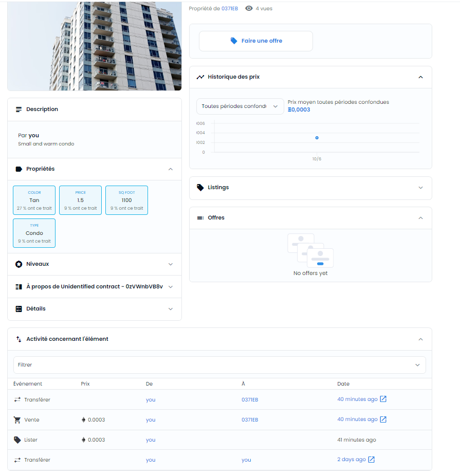

# Udacity Blockchain Capstone

The capstone will build upon the knowledge you have gained in the course in order to build a decentralized housing product. 

## Install
 
This repository contains Smart Contract code in Solidity (using Truffle) and tests (also using Truffle).

To install, download or clone the repo, then:

`npm install`

`cd eth-contract`

`truffle --netword dev compile`
  

## Test
 
Tests for smart contracts are available.
  

`cd eth-contract`

`truffle --netword dev compile`

 

## Dependencies
  

    Truffle : v5.0.2 (core: 5.0.2)
    Solidity : v0.5.0 (solc-js)
    Node : v16.17.1
    lite-server: 2.4.0
    @truffle/hdwallet-provider: 2.0.15
    openzeppelin-solidity: 2.2.0
    solc: 0.5.2
    solc-js: 0.5.2
 

## Contract address

> Because of visibility issues in Opensea, the contract has been deployed on the goerly test network.
 

### Contract address 'SolnSquareVerifier'
 

0x89Cd8929E82B0CA1D60c87634caA560168637454
 

### Links

- 'SolnSquareVerifier' contracts's transaction on Etherscan

`https://goerli.etherscan.io/address/0x89Cd8929E82B0CA1D60c87634caA560168637454`

- Contract's collection on Opensea

`https://testnets.opensea.io/fr/collection/unidentified-contract-0zvwnbvb8v`

- Sales of two tokens
 

 

 

## Project Resources

* [Remix - Solidity IDE](https://remix.ethereum.org/)
* [Visual Studio Code](https://code.visualstudio.com/)
* [Truffle Framework](https://truffleframework.com/)
* [Ganache - One Click Blockchain](https://truffleframework.com/ganache)
* [Open Zeppelin ](https://openzeppelin.org/)
* [Interactive zero knowledge 3-colorability demonstration](http://web.mit.edu/~ezyang/Public/graph/svg.html)
* [Docker](https://docs.docker.com/install/)
* [ZoKrates](https://github.com/Zokrates/ZoKrates)